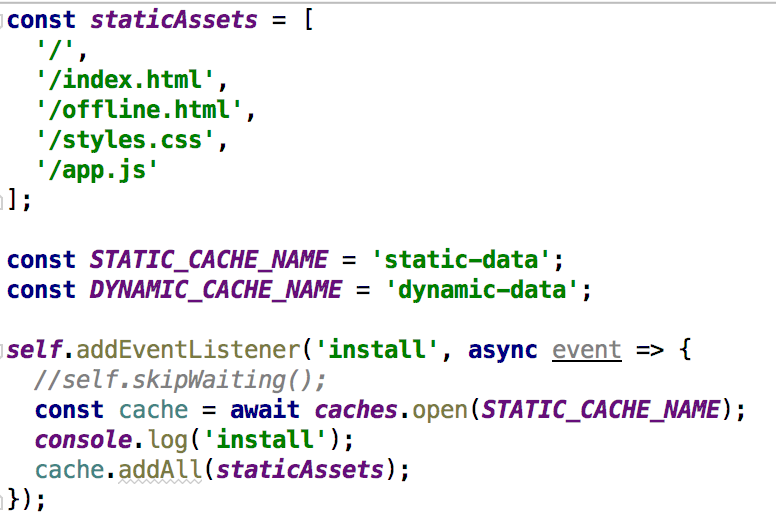
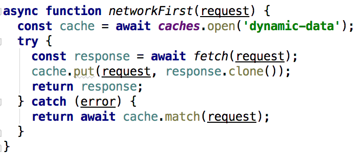

# Fast start with PWA. Service Workers. Кеширование

## Что такое Progressive Web Apps
Веб-проекты, которые выглядят и ведут себя, как мобильные приложения:
* Работают в режиме ```offline```
* Имеют иконку на рабочем столе
* Синхронизируют данные в фоновом режиме


---

## Плюсы и возможности
**Плюсы**
* Надежные - моментальная загрузка, вы никогда не увидите динозаврика
* Быстрые - быстрый отклик на действия пользователя с плавной анимацией и скроллом
* Чарующие - предоставляется максимально возможный нативный пользовательский опыт

**Возможности**
* ```Push``` уведомления
* Фоновая синхронизация
* Доступность ```offline```
* Возможность установки на рабочий экран телефона   
* Доступ к камере устройства
* Доступ к геопозиции 
...

---

## PWA и SPA

SPA можно преобразовать в PWA, так же как и любую другую веб-страницу

---

## Основные "слоны" PWA

* Server Workers
* Фоновая синхронизация
* ```Push``` уведомления
* Манифест, разрешающий добавление на рабочий экран

---
## Lighthouse

Расширение диагностики сайта под Chrome. Проверяет:
* Как быстро грузится сайт
* Форматы картинок и их сжатие
* Неиспользуемый css
* SEO
* Best practice
* Соответствие требованиям PWA
    * Скорость загрузки в 3G
    * Доступность ```offline```
    * Возможность установить 

---

## manifest.json

Обычный json файл, содержащий информацию для браузера, как ваше веб-приложение должно себя вести, когда "установлено" на мобильное устройство. 

Наличие этого файла обязательно в Chrome для показа предложения ```Add to Home Screen``` 

---

## Web App Manifest Generator

Сервис генерации манифеста для проекта (open source)

https://app-manifest.firebaseapp.com/
 
---

## Тестирование на реальном устройстве

1. Chrome dev tools -> more tools -> remote devices
1. Дать доступ на экране устройства
1. Поставить галочку ```Port forwarding```, добавить новое правило с адресом PWA
1. Кликнуть по имени устройства
1. New tab -> адрес PWA -> inspect

---

## HTML
Добавьте в тэг ```head```
```html
<link rel="manifest" href="/manifest.json">
<meta name="viewport" content="width=device-width, initial-scale=1">
<meta name="theme-color" content="#2196f3">
```

---

## Service Workers

```Service Workers``` представляют собой процессы в фоновом режиме, которые обеспечивают взаимодействие между приложением и сетью. Данные процессы способны перехватывать http-запросы и кешировать информацию, что может быть использовано для подгрузки данных при отсутствии сети.
В плане реализации ```Service Workers``` - это javascript скрипты, которые слушают события и выполняют задачи.

**Browser support**


---

## Service Worker lifecycle

1. register
1. installation
1. activation
1. idle
1. termination


---
## Кеширование с Service Workers
**Зачем?**
* Плохое соединение
* Нет соединения (лифт/метро)
* Lie-Fie

**Как?**

Cache API - механизм для хранения пары запрос/ответ (без поддержки в Safari)

**Что?**
* js
* css
* картинки
* шрифты


---
## cashes
Объект, отвечающий за взаимодействие с кешем
Основые методы:
* match(Request) - Проверяет, является ли данный Request ключом в любом из объектов Cache, отслеживаемых объектом CacheStorage, и возвращает Promise, который успешно завершится, когда найдет совпадение.
* open(cacheName) - Возвращает Promise, который успешно завершится, когда объект Cache найдет необходимый объект с cacheName (если такого нет, то создаст новый).
* has(cacheName) - Возвращает Promise, который успешно завершится и вернет true, если объект Cache содержит кеш с установленным cacheName.

---

## Динамическое кеширование
Метод ```put``` позволяет добавлять данные налету.


## Когда обновляется Service Worker?

* При **закрытии** вкладки со старым процессом и открытии новой
* Добавить строчку ```self.skipWaiting();``` в listener для install 
 
---
## Полезные ссылки

* [Progressive Web Apps](https://developers.google.com/web/progressive-web-apps/)
* [Are Service Workers Ready?](https://jakearchibald.github.io/isserviceworkerready/)
* [Getting Started with Service Workers](https://developers.google.com/web/fundamentals/getting-started/primers/service-workers)
* [Upgrading Your Service Worker Cache](https://www.afasterweb.com/2017/01/31/upgrading-your-service-worker-cache/)
* [Cache MDN](https://developer.mozilla.org/en-US/docs/Web/API/Cache)
* [Caching strategies](https://serviceworke.rs/caching-strategies.html)
* [The Web App Manifest](https://developers.google.com/web/fundamentals/web-app-manifest/)
* [Progressive Web Apps 101: the What, Why and How](https://medium.freecodecamp.org/progressive-web-apps-101-the-what-why-and-how-4aa5e9065ac2)
* [Progressive Web Apps 102: Building a Progressive Web App from scratch](https://medium.freecodecamp.org/progressive-web-apps-102-building-a-progressive-web-app-from-scratch-397b72168040)
* [Response.clone()](https://developer.mozilla.org/en-US/docs/Web/API/Response/clone), [Why do we perform response.clone()?](https://github.com/mozilla/serviceworker-cookbook/issues/264)